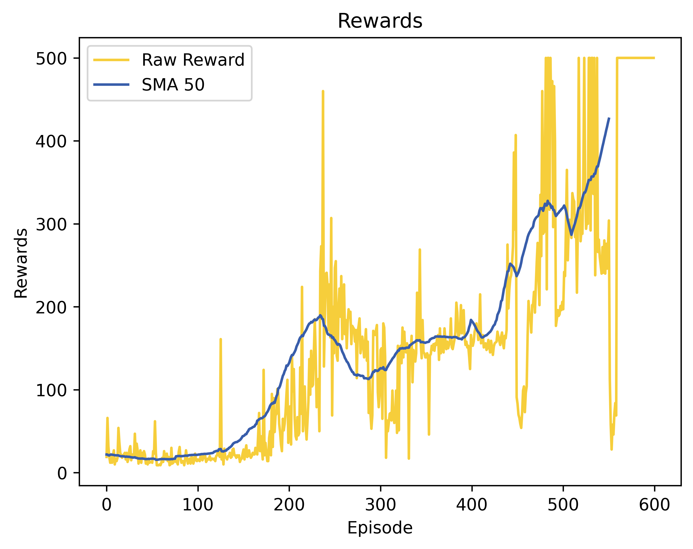
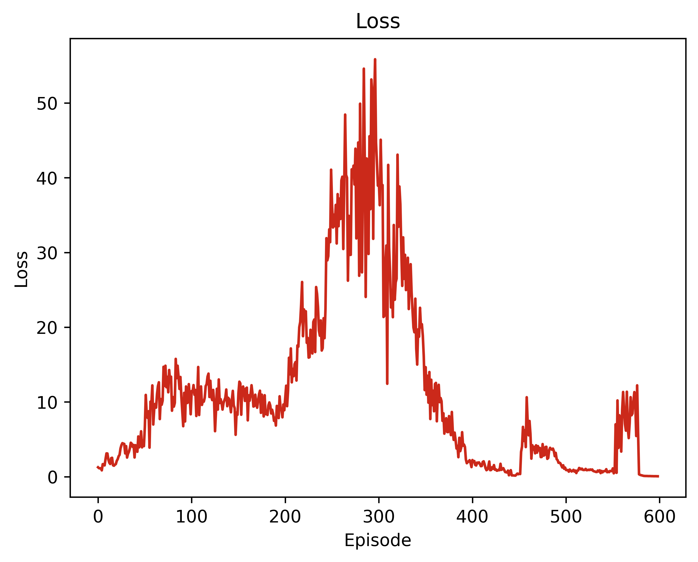

# Cart Pole DQN

This project implements a Deep Q-Network (DQN) agent to solve the Cart Pole environment using the Gymnasium library. The agent learns to balance a pole on a moving cart through reinforcement learning. The goal is to maximize the total reward by keeping the pole upright for as long as possible. According to Gymnasium documentation, the threshold for rewards is 500 for v1 and 200 for v0.


The DQN algorithm utilizes a neural network to approximate the Q-values for each action based on the current state of the environment. It employs experience replay memory and target networks to stabilize learning and improve performance over time.

## File Structure

- `DQN.py`: Contains the core components of the DQN algorithm, including the replay memory, DQN network architecture, and the DQN agent class responsible for learning and decision-making.
- `config.py`: Configures GPU settings and sets random seeds for reproducibility.
- `cart_pole.py`: Implements the training and testing loop for the DQN agent in the Cart Pole environment. This file contains all relevant hyperparameters and configurations for training.

## Installation

Ensure you have the following packages installed:
```bash
pip install torch numpy matplotlib gymnasium pygame

```

## Usage
1. **Set Up the Environment**: Ensure your environment supports either CPU or CUDA.

2. **Run the Training**: Execute the `cart_pole.py` file to start training the DQN agent. You can adjust hyperparameters directly within this file.

```bash
python cart_pole.py
```
3. **Monitor Performance**: During training, the agent's performance can be monitored through loss plots and reward metrics.

## Code Overview


### Configuration (config.py)

- Device Configuration: Automatically chooses between CUDA and CPU for model training.
- Random Seed: Ensures reproducibility by setting seeds for NumPy and PyTorch.

### DQN Implementation (DQN.py)
- Replay Memory: Stores past experiences to enable efficient learning.
- DQN Network: A neural network with fully connected layers designed to approximate Q-values.
- DQN Agent: Contains methods for action selection (epsilon-greedy and Boltzmann), learning from experiences, and updating network parameters.
- The DQN implementation supports two action selection strategies:

### Training and Testing Loop (cart_pole.py)
- Step and Observation Wrappers: Modify the Cart Pole environment's observations to normalize and clip values.
- Training Class: Handles the training and evaluation of the DQN agent, including logging rewards and losses, saving model weights, and plotting results.
## Policy Strategies


## Example Configuration in `cart_pole.py` 
(Here we are using epsilon greedy policy)  
```python
RL_hyperparams = {
    "train_mode": True,
    "save_interval": 200,
    "learning_rate": 6e-4,
    "discount_factor": 0.99,
    "batch_size": 32,
    "update_frequency": 10,
    "max_episodes": 600,
    "epsilon_max": 0.999,
    "epsilon_min": 0.01,
    "epsilon_decay": 0.996,
    "memory_capacity": 10000 if train_mode else 0,
    "e_greedy": True,  # Set to True for epsilon-greedy, False for Boltzmann
}

```

## Plots

After training with above hyperparameters, you will find the following plots:

- **Rewards Plot:**
  

- **Loss Plot:**
  

